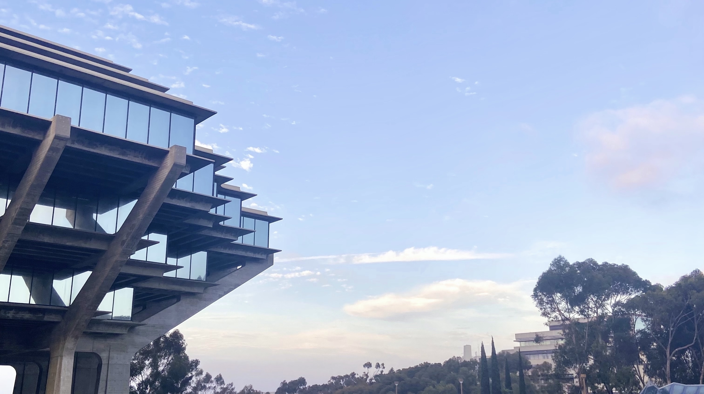

# **ABOUT ME**

My name is Linda Vuong and I'm a senior standing undergraduate student at the University of California, San Diego. 

I am majoring in Mathematics and Computer Science and am aiming for a job in tech in the near future.

---

## Experience at UCSD
I am a full time student and have taken the following classes:
- `Software Tools & Techniques Lab`
> Developed websites using GitHub/ GitHub Desktop

> Edited pages from terminal using Vim
- `Data Structures and OO Design in Java`
> Implemented several data structures such as Linked List, Array List, Maps, etc...
- `Modern Algebra I and II` 
- `Theory of Computation`
> Worked with Turing machines and other models of computation (NFA, PDA)

> Implemented non-regular languages into their specific diagrams and then into code (used Java)

&nbsp;

Work in Progress Classes:
- `Advanced Data Structures in C++`
- `Introduction to Math Analysis I`
- `Discrete Math & Graph Theory`
&nbsp;

---

## Experience in the Field
Unfortunately I have yet to gain any experience in the field as I've been prioritizing my education, but I am now ready to display my knowledge by getting some hands-on, practical work.

--- 

***I look forward to working with you in the future. Thank you and take care!***

