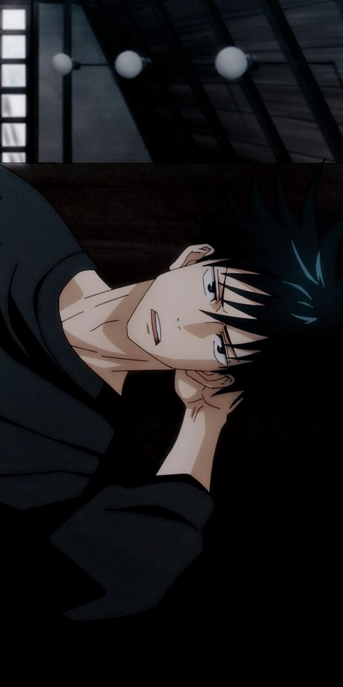

# **helloo party people!**

Welcome to my (Linda Vuong's) GitHub website! 

Glad you chose to stay and look at my *somewhat interesting* web layout. Times have been rough lately with learning online, as well as the most recent COVID surge with a tremendous increase of cases. Hope you're all healthy and doing well! ᕙ(⇀‸↼‶)ᕗ

  **DISCLAIMER!!! I cannot promise there will be super super A5 Wagyu quality content on here. Continue at your own risk!! ☆*:.｡.o(≧▽≦)o.｡.:*☆**
  
  --- 
  

Enjoy this very nice, HD picture of `Inumaki Toga` from the manga/ anime `Jujustu Kaisen`. It is a must watch. I reccommend!! I am also currently reading the manga!

  --- 
  ---

  &nbsp;
  
  > Anywho links to my CSE15 LAB REPORTS: 
  >  1. [LAB REPORT 1 - TUTORIAL ](https://lhvuong11.github.io/cse15L-lab-reports/lab-report-1-week-2.html)
  > 2. [LAB REPORT 2 - DEBUGGING ](https://lhvuong11.github.io/cse15L-lab-reports/lab-report-2-week-4.html)
  > 3. [LAB REPORT 3 - GROUP OPTION 1 ](https://lhvuong11.github.io/cse15L-lab-reports/lab-report-3-week-6.html)
  
  &nbsp;

  ---
  ---

  &nbsp;

  Here's another nice (yet another) picture of one of my favorite Jujutsu Kaisen characters `Megumi Fushiguro` hehe.
  
