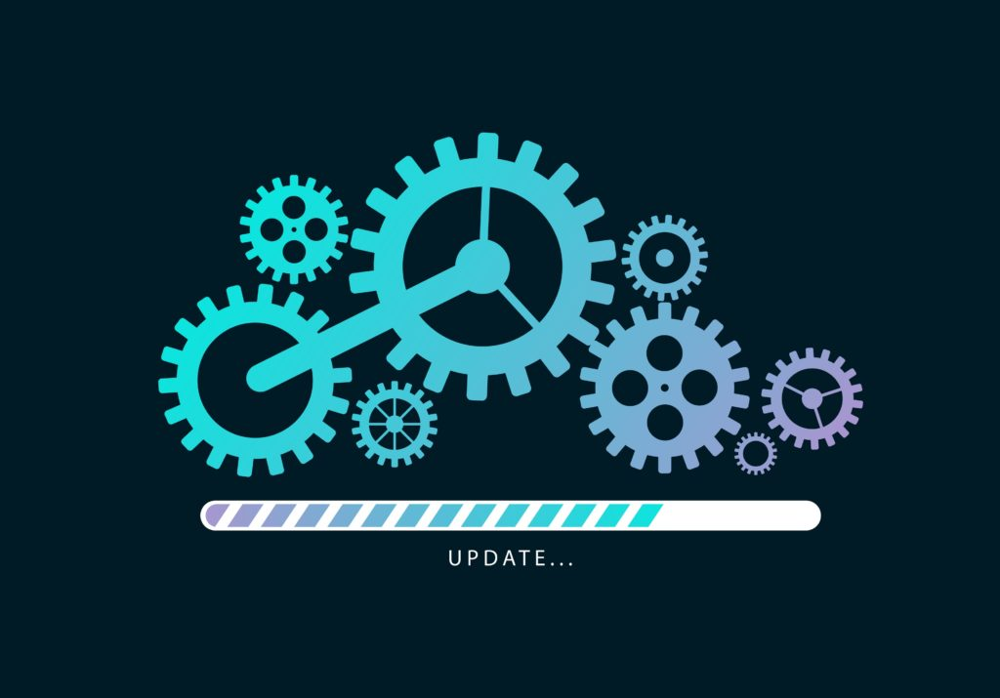
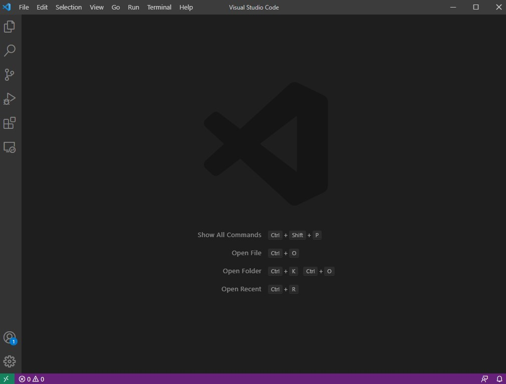
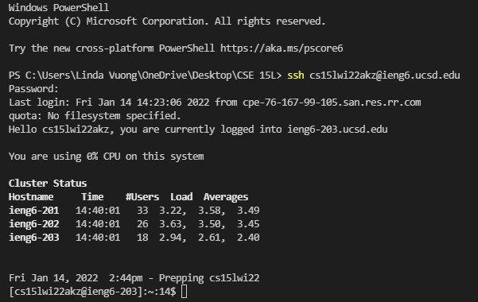
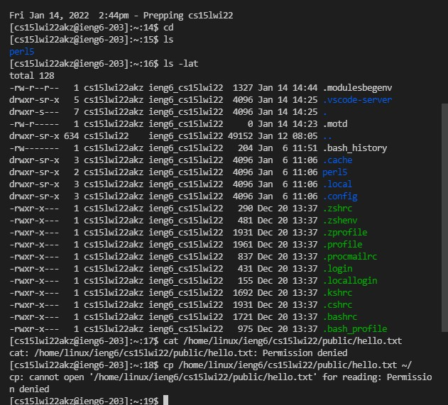

# **LAB REPORT 1**



Hello incoming 15L students!
This blog post will be a tutorial about how to log into your course-speical account on `ieng6` (the UCSD basement server). 

---

## Step 1: *Installing VScode*
Go to [Visual Studio Code](https://code.visualstudio.com/) and download and install it on your device.

> It should look something like this (may differ depending on system/ display settings).




## Step 2: *Remotely Connecting*
Here we will be connecting VScode to a remote device over the Internet!

Since I'm operating on Windows, I'll be giving instructions for Window users (my apologies to other users reading this). 

1. Install [OpenSSH](https://docs.microsoft.com/en-us/windows-server/administration/openssh/openssh_install_firstuse) using the link attached.
2. Look up your course-specific account for CSE15L : [CSE15L-Account](https://sdacs.ucsd.edu/~icc/index.php)
3. Open your terminal in VSCode using the Terminal menu and type in a `ssh` command replacing my account with your own.

    ``` $ ssh cs15lwi22akz@ieng6.ucsd.edu```

    Continue connecting by pressing "yes", enter your password and you should get something like this
    > 

Congrats! Your terminal is now connected to a computer in the UCSD CSE basement! 


## Step 3: *Trying Some Commands*
Now that everything's set up, let's try running some commands!
Here are some commands to try:
- `cd`
- `cd ~`
- `ls` 
- `ls -lat`
- `pwd`
- `cp /home/linux/ieng6/cs15lwi22/public/hello.txt ~/`
- `cat /home/linux/ieng6/cs15lwi22/public/hello.txt`

> Here's an example of how mine looks:



## Step 4: *Moving Files with scp*


## Step 5: *Setting an SSH Key*


## Step 6: *Optimizing Remote Running*

