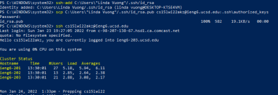
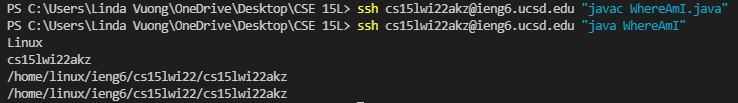

# **LAB REPORT 1**


Hello incoming 15L students!
This blog post will be a tutorial about how to log into your course-speical account on `ieng6` (the UCSD basement server). 

---

## Step 1: *Installing VScode*
Go to [Visual Studio Code](https://code.visualstudio.com/) and download and install it on your device.

> It should look something like this (may differ depending on system/ display settings).


## Step 2: *Remotely Connecting*
Here we will be connecting VScode to a remote device over the Internet!

Since I'm operating on Windows, I'll be giving instructions for Window users (my apologies to other users reading this). 

1. Install [OpenSSH](https://docs.microsoft.com/en-us/windows-server/administration/openssh/openssh_install_firstuse) using the link attached.
2. Look up your course-specific account for CSE15L : [CSE15L-Account](https://sdacs.ucsd.edu/~icc/index.php)
3. Open your terminal in VSCode using the Terminal menu and type in a `ssh` command replacing my account with your own.

    ``` $ ssh cs15lwi22akz@ieng6.ucsd.edu```

    Continue connecting by pressing "yes", enter your password and you should get something like this
    > 

Congrats! Your terminal is now connected to a computer in the UCSD CSE basement! 


## Step 3: *Trying Some Commands*
Now that everything's set up, let's try running some commands!
Here are some commands to try:
- `cd`
- `cd ~`
- `ls` 
- `ls -lat`
- `pwd`
- `cp /home/linux/ieng6/cs15lwi22/public/hello.txt ~/`
- `cat /home/linux/ieng6/cs15lwi22/public/hello.txt`

> Here's an example of how mine looks:


## Step 4: *Moving Files with scp*
 *A key step in working remotely is being able to copy files between computers.*

 We'll be copying a file from our computer to a remote computer in this exercise by using a command called `scp`, which stands for secure copy.

 1. Create a file on your computer called `WhereAmI.java` with the following contents in it:
     ```
     class WhereAmI { 
         public static void main(String[] args) {
             System.out.println(System.getProperty("os.name"));
             System.out.println(System.getProperty("user.name"));
             System.out.println(System.getProperty("user.home"));
              System.out.println(System.getProperty("user.dir"));
            }
        }
    ```
    2. In the terminal from the directory where `WhereAmI.java` was made, run the command using: (but with your username)
    ``` scp WhereAmI.java cs15lwi22zakz@ieng6.ucsd.edu:~```
    3. Enter your password!
    Now, log into `ieng6` again using the `ssh` command and use `ls`.
        > You should see something along these lines!
        


## Step 5: *Setting an SSH Key*
Using `ssh` keys is a way to make logging in or running `scp` a little less tedious (by us not having to type in our password 10,000 times). 

1. Run this to set up `ssh-keygen`, a program that creates a pair of files called the *public key* and *private key*
    > Replace my name with yours!
    ```
    # on client (your computer)
    $ ssh-keygen
    Generating public/private rsa key pair.
    Enter file in which to save the key (C:\Users\Linda Vuong/.ssh/id_rsa): \Users\Linda Vuong/.ssh/id_rsa
    Enter passphrase (empty for no passphrase): 
    Enter same passphrase again: 
    Your identification has been saved in \Users\Linda Vuong/.ssh/id_rsa.
    Your public key has been saved in \Users\Linda Vuong/.ssh/id_rsa.pub.
    The key fingerprint is:
    SHA256:ay5ICgx/MrP2brsHxZ5R0xEiNBZ3VkDSzRWUEDTsppc linda vuong@DESKTOP-KTSE4VM
    The key's randomart image is:
    +---[RSA 3072]----+
    |                 |
    |       . . + .   |
    |      . . B o .  |
    |     . . B * +.. |
    |      o S = *.B. |
    |       = = O.*.*+|
    |        + * *.BE+|
    |           +.+.o |
    |             ..  |
    +----[SHA256]-----+
    ```
    2. Windows operators need to follow extra `ssh-add` steps: [ssh-add-steps](https://docs.microsoft.com/en-us/windows-server/administration/openssh/openssh_keymanagement#user-key-generation) - Make sure you're running PowerShell Administrator for this part!
    3. To copy the public key to `.ssh`'s directory: (Make sure you're using your user!!)

    ``` 
    $ ssh cs15lwi22akz@ieng6.ucsd.edu
    Enter Password
    # now on server
    $ mkdir .ssh
    $ logout
    # back on client
    $ scp \Users\Linda Vuong/.ssh/id_rsa.pub cs15lwi22@ieng6.ucsd.edu:~/.ssh/authorized_keys 
    ```
    
    > This is what it should look like after saving the id_rsa.pub!
    

## Step 6: *Optimizing Remote Running*
Now you'll be using everything in this tutorial to make some local edits to `WhereAmI.java`, then copying it to the remote server and running it.

- To directly run on the remote server: write commands in quotes at the end of an `ssh` command
    > `ssh cs151wi22@ieng6.ucsd.edu "ls" `

- Use semicolons to run multiple commands on the same line
    > `sp WhereAmI.java OtherMain.java; javac OtherMain.java; java WhereAmI" `

- Use the up arrow on your keyboard to recall the last command that was a run


    **My Experience // Trying to get the least keystrokes**

    - Copy and paste was my best friend. Instead of typing out my username with 24 keystrokes, copy and pasting reduced it to about 5. It also saved me time by not making as many typos and so I don't have to look back at my user to make sure I typed it correctly.

    - Having the id_rsa.pub key saved, saved a lot of time since I'm not worrying if I typed my password wrong especially since we can't even see what we're typing. It saved exactly 11 keystrokes (including the enter key).

    - The fastest process I came up with was to implement the first hint. Without being already logged into the remote server, I was able to run `WhereAmI.java` with a few additions.
    I ran:

    ```
    ssh cs15lwi22akz@ieng6.ucsd.edu "javac WhereAmI.java" 
    ssh cs15lwi22akz@ieng6.ucsd.edu "java WhereAmI" 
    ```
    

    It saved me the additional keystrokes that comes with logging into the server and retyping `javac` and `java`. Plus my username was copied and pasted! So even less key strokes!

--- 


***THANKS FOR TUNING IN TO THIS TUTORIAL! HOPE TO SEE YOU SOON & STAY SAFE OUT THERE***

