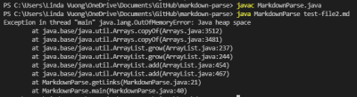
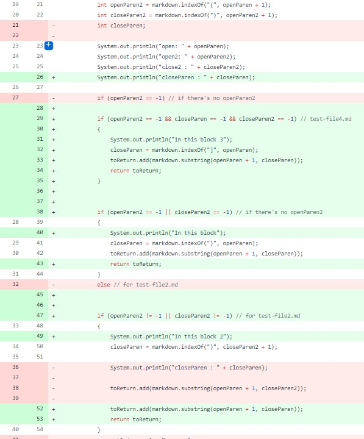
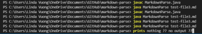
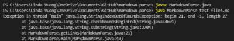
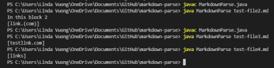

# **LAB REPORT 2**

 

---

My lab group ***(Fire Salamander)*** tried to come up with some failure-inducing inputs in lab 3 and we both failed (pun intended?) and succeeded in making  `MarkdownParse.java` return an error. 

We also got some expected outputs as well wwhen trying to find a sample failure-inducing input. 

Here are some of the code changes that ***Fire Salamander*** worked on in order to fix a bug : 
Since `MarkdownParse.java` reads whatever is between the ` ( , ) , [ , ] ` we decided to add and remove certain numbers of each.

---
---

## Code Change 1 : *An Infinite Loop*
With a `test-file2.md` consisting of 
```
[a link!](link.(com))
```

We were expecting the output of "link.(com)" but when running `test-file2.md` , an infinite loop occured.

> Symptom: infinite loop : OutOfMemoryError

>> [Commit Message History](https://github.com/lhvuong11/cse15L-lab-reports/blob/main/2fail.png)
\
>> [Link to failure-inducing test-file](https://github.com/lhvuong11/markdown-parse/blob/main/test-file2.md)


> Code Change Difference in GitHub
 
`test-file2.md` , `test-file3.md` , and `test-file4.md` 's changes were committed at the same time. Next time, I'll be sure to commit them separately as it'll be easier to track. I need to get used to committing to GitHub Desktop!

The failure-inducing input contains another pair of parentheses inside the original outer pair of parentheses. The original `MarkdownParse.java` didn't take other pair of parentheses into consideration so it doesn't know with was the right `( )` to stop the index which resulted in an infinte loop as the symptom.

&nbsp;


## Code Change 2 : *Another Infinite Loop with different test-file*
With a `test-file3.md` consisting of 
```
[a link!][(testlink.com)]
```

We were expecting the output of "links]" but when running `test-file3.md` , nothing printed in the terminal. No error, but also no output in general.

> Symptom: Not printing expected output

>>[Commit Message History](https://github.com/lhvuong11/cse15L-lab-reports/blob/main/3fail.png)
\
>> [Link to failure-inducing test-file](https://github.com/lhvuong11/markdown-parse/blob/main/test-file3.md)


> Code Change Difference in GitHub


The failure-inducing input has an extra pair of brackets on the outside of the parentheses. `MarkdownParse.java` is supposed to only read inside the parentheses and doesn't take another pair of brackets in consideration. My thought process was for MarkdownParse to ignore the extra pair and to still return the inner link.

&nbsp;

## Code Change 3 : *StringIndexOutOfBoundsException*

With a `test-file4.md` consisting of 
```
[a link!](links]
```

We deliberately removed the closing parentheses to see if it was a fail-inducing input and it was.

> Symptom: StringIndexOutOfBounds Error

>> [Commit Message History](https://github.com/lhvuong11/cse15L-lab-reports/blob/main/4fail.png)
\
>> [Link to failure-inducing test-file](https://github.com/lhvuong11/markdown-parse/blob/main/test-file4.md)

> Code Change Difference in GitHub


The failure-inducing input is missing the corresponding `)` parentheses, but we still want the link to be read. The pervious `MarkdownParse.java` code returned a *StringIndexOutOfBounds* when running `test-file4.md`. My thought process was to in a sense replace `)` with the closing bracket `]` in order to read the inner link.

&nbsp;

       --- This is the finished result! ---


&nbsp;

Strangely enough (or not so strangely), I was able to fix the bugs my lab group and I came up with, but then the original `test-file.md` now returned a *StringIndexOutOfBounds* error.

Do I need to fix this error since I fulfilled the lab's task of debugging the 3 errors? If yes, how do i go about revising this?

--- 


***THANKS FOR READING MY DEBUGGING LAB! STAY SAFE AND HAVE A GREAT REST OF YOUR DAY!!***