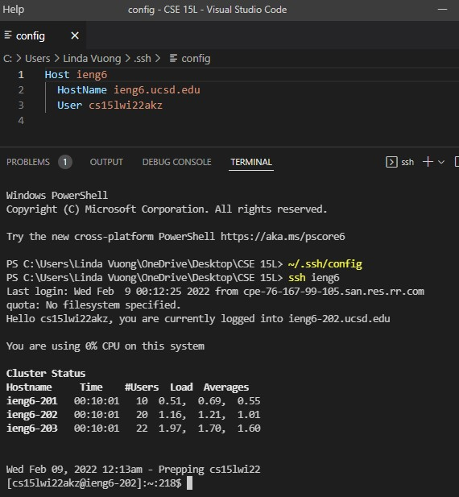
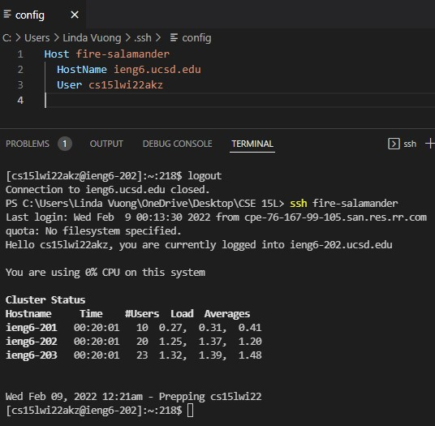
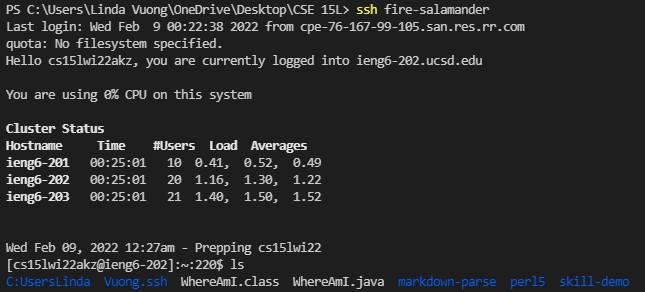
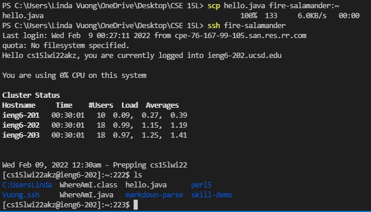

# **LAB REPORT 3**

 

---
## Group Choice Option 1:  *Streamlining `ssh` Configuration*

- Show your `.ssh/config` file, and how you edited it (with VScode, another program, etc)

> This was my `.ssh/config` file just following the directions from Week 5.
I chose to edit it with VScode in order to be consistent since we've been using VScode in this class.


&nbsp;

- Show the `ssh` command logging you into your account using just the alias you chose

> I decided to change the `ieng6` host alias to my lab group's name `fire-salamander` :D I logged out of the server and tried `ssh`-ing back into the server using my alias and it works as long as the `HostName` stays as `ieng6.ucsd.edu`.



&nbsp;

- Show an `scp` command copying a file to your account using just the alias you chose.

> This is how my `list files` looked like before `scp`-ing anything.


I made a simple `hello.java` file with a `main` method printing out "Hello" and 
following the syntax of the code below, I copied `hello.java` to my account using just the alias I chose by using the `scp` command.

```
scp file.java cs15lwi22zz@ieng6.ucsd.edu:~
```
By replacing `file.java` with `hello.java` and `cs15lwi22zz@ieng6.ucsd.edu` with `fire-salamander`, I'm able to successfully `scp` the file and the file appears in the account's `ls`.

> This is how my `list files` look like after `scp`-ing `hello.java`!



