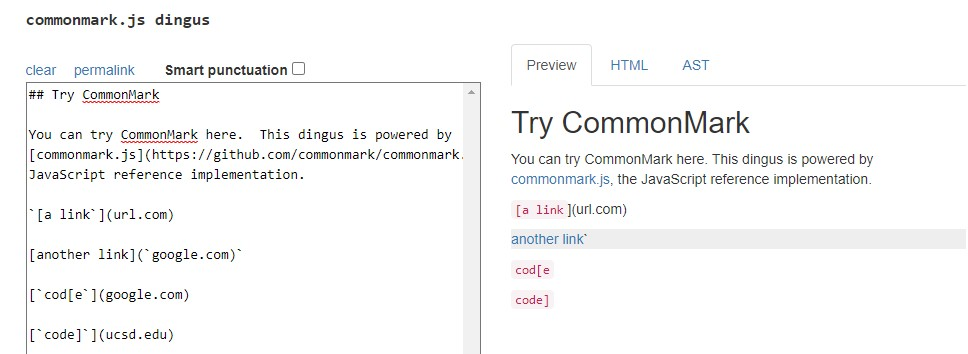
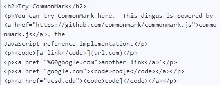
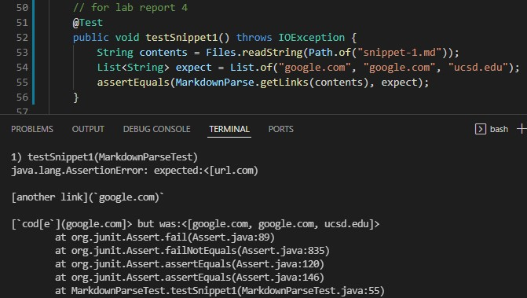
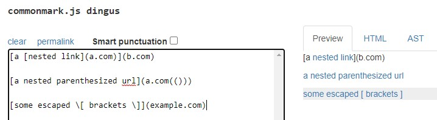
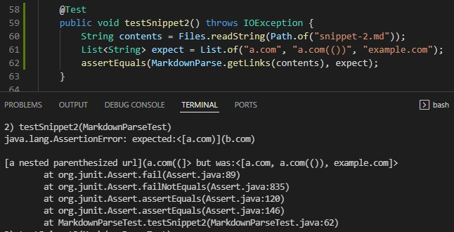
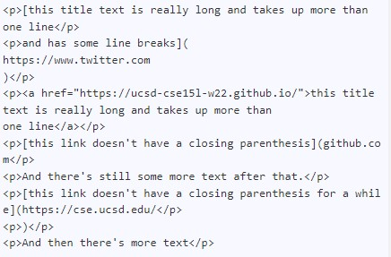
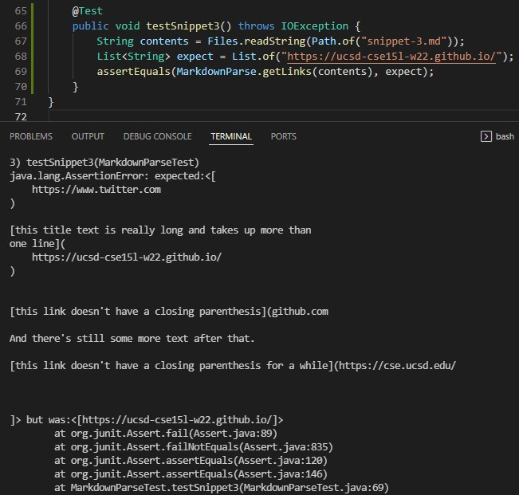

# **LAB REPORT 4**

 

---

[Link to my markdown-parse repository: Team Fire Salamander](https://github.com/lhvuong11/markdown-parse)

[Link to the one I reviewed: Team Patoo](https://github.com/IncogOwl/markdown-parse)

***Due to some syntax in JUnit, the expected and actual are switched***

---
## Snippet 1: 

```
`[a link`](url.com)

[another link](`google.com)`

[`cod[e`](google.com)

[`code]`](ucsd.edu)
```

- Using the [CommonMark demo site](https://spec.commonmark.org/dingus/) :




I checked to see which "links" are valid and the output should be what's considered a link in `href` html where the links we want are syntax'd as follows
"%60google.com", "google.com", "ucsd.edu".

- I turned `Snippet 1` into a test in `MarkdownParseTest.java` and when I run the test in **my implementation**, I get the following 



&nbsp;

## Snippet 2:

```
[a [nested link](a.com)](b.com)

[a nested parenthesized url](a.com(()))

[some escaped \[ brackets \]](example.com)
```
- Using the [CommonMark demo site](https://spec.commonmark.org/dingus/) :




Similarly: the links we want are syntax'd as follows
"a.com", "a.com(())", "example.com".

- I turned `Snippet 2` into a test in `MarkdownParseTest.java` and when I run the test in **my implementation**, I get the following 




&nbsp;

## Snippet 3:

```
[this title text is really long and takes up more than 
one line

and has some line breaks](
    https://www.twitter.com
)

[this title text is really long and takes up more than 
one line](
    https://ucsd-cse15l-w22.github.io/
)


[this link doesn't have a closing parenthesis](github.com

And there's still some more text after that.

[this link doesn't have a closing parenthesis for a while](https://cse.ucsd.edu/


)

And then there's more text
```

- Using the [CommonMark demo site](https://spec.commonmark.org/dingus/) :




Similarly: the link we want are syntax'd as follows "https://ucsd-cse15l-w22.github.io/".

- I turned `Snippet 2` into a test in `MarkdownParseTest.java` and when I run the test in **my implementation**, I get the following 



&nbsp;

## My Implementation:

- ***Snippet 1:*** 
I think there's possibly a <10 line code change that would make my program work as my code in its current state is still not "correct" for the original `test-file.md`. After editing some lines (not really adding), I think by adding a conditional statement that either accepts or rejects backticks, the code should give us an expected output.

- ***Snippet 2:*** 
I think that there's also a possibility that my program would work by making a small change. In order to work for nest parentheses, I originally had a `openParen2` variable, but I could potentially just increment the `openParen` variable and use the same implementation for more nest parentheses, brackets, and escaped brackets.

- ***Snippet 3:***  
I don't think that a small code change would be enough for my program to work. The test cases I had prior didn't take into consideration of newlines and it would take some trial and error in order to fix such an error.

---

***THANKS FOR READING MY LAB! STAY SAFE AND HAVE A GREAT REST OF YOUR DAY!!***


