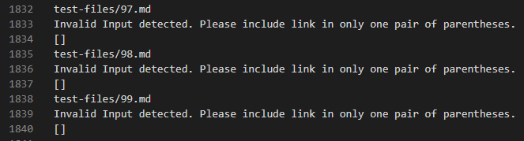
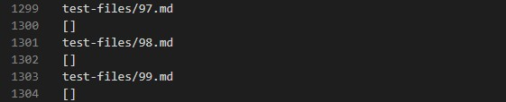
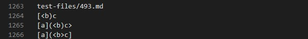
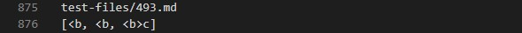
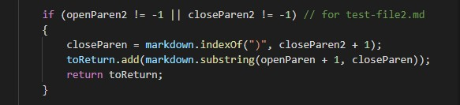

# **LAB REPORT 5**

 

---

***Choose any 2 tests from the 652 commonmark-spec tests where your implementation had different answers than the implementation provided***

The tests with different answers should correspond to **different bugs** - that is, you couldn't easily fix both with one code change.

- How did you find the tests with different results (Did you use `diff` on the results of running a bash for loop? Did you search through manually? Did you use some other programmatic idea?)
> Since my program had print statements which printed `"Invalid Input"` on the part of the user, I had many different results on my `results.txt`. Instead of using `diff` which would mark almost every line, I just search through manually.

---
## Bug #1: 
> My implementation


> Implementation provided



```
test-files/97.md contains ====
```
- I think the both implementations are correct. `test-files/97.md` doesn't contain a valid link and if a test file doesn't contain a link then the expected output is an empty list `[]`. Both implementations got an empty list as the output, but the only difference is my implementation included an error message.

- No fix is needed as I think it was correctly implemented.


## Bug #2:
> My implementation


> Implementation provided


```
test-files/493.md contains 

[a](<b)c
[a](<b)c>
[a](<b>c)
```


- I think the implementation provided was correct as the text within the `( )` are considered as valid links. I'm still going back and forth if it's REALLY correct since technically `<b` and `<b>c` are not links (via html format), but it depends on the interpretation of what a valid link is. Judging based on just as text in the parentheses, it is.

- As for my incorrect implementation, the bug is my program interpreted the last closing parentheses as the only closing parentheses there is so it printed out everything within the file with the exception of what comes before the first opening parentheses. 
The code that I'd need to fix would definitely be the one regarding reading close parentheses so:


---

***THANKS FOR READING MY LAB! STAY SAFE AND HAVE A GREAT REST OF YOUR DAY!!***


